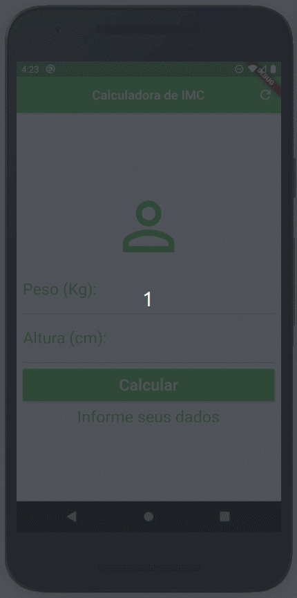

# Calculadora de IMC

Projeto simples de cálculo de IMC utilizando o Flutter

Widgets utilizados:
* AppBar
* Column
* Container
* Form
* GlobalKey
* Icon
* IconButton
* Padding
* RaisedButton
* SingleChildScrollView
* Text
* TextFormField
